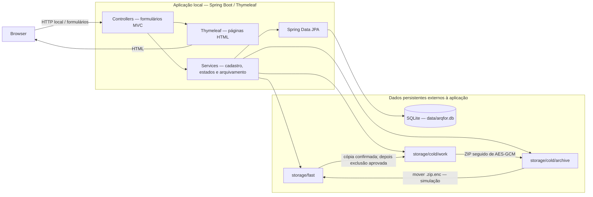

# Arquitetura proposta — arqfor_v1.0

Status: plano aprovado em 2026-09-08; cadastro, ZIP/cifra e orquestração implementados por recortes. Uma aplicação web local monolítica renderiza HTML com Spring Boot 3.x/Thymeleaf, em Java 21 LTS. Controllers recebem formulários; Services validam hashes, estados e coordenam arquivos; Spring Data JPA persiste metadados SQLite. EvidenceController conecta POST /evidences/{id}/archive à orquestração e redireciona aos detalhes, que exibem a senha persistida com escape HTML e sem expor a chave. Validação Maven/JUnit 5 e checkpoints registrados em tasks.md.

## Separação entre aplicação e dados

O código e futuro pacote da aplicação ficam separados de `data/arqfor.db` e `storage/`. Esses caminhos derivam de forenstorage.data-root, cujo padrão é . para execução na raiz do projeto; em outros diretórios, configurar uma raiz absoluta estável. DataSourceConfiguration cria o pai do banco antes de abrir o pool JDBC. Overrides individuais de URL e storages são preservados; não há migração automática do antigo forenstorage.db. Na futura demonstração Compose, mapear ambos para persistência no host fora da camada descartável do container. Não criar volumes ou Compose agora. SQLite guarda identificador único, path atual, hashes informado e verificado, data de cadastro, status, mensagem de erro, senha didática, chave AES, IV e parâmetros criptográficos. O arquivo fica no filesystem, não em BLOB. A chave armazenada ao lado dos dados e exibida no ambiente sem login é limitação acadêmica.

## Fluxo de arquivamento síncrono

Implementado por ArchivingService, StorageCopyService, ZipService e CryptoService após aprovação explícita de exclusão-fast-storage. A [revisão do fluxo](archiving-orchestration-review.md) contém regras, testes e limites. Transações curtas confirmam cada mudança de banco; uma operação de arquivo nunca depende de commit futuro para autorizar exclusão. O contexto de etapas pertence à chamada síncrona, não acrescenta estados à entidade e não implementa recuperação pós-crash. Há somente duas passagens globais, incluindo falhas em etapas diferentes.

1. Validar EM_ANALISE e arquivo `.dd` cadastrado dentro de storage/fast; persistir ARQUIVANDO.
2. Copiar por streaming para área própria da evidência em storage/cold/work, sem sobrescrever arquivos de outra evidência. Confirmar término da cópia, fechamento bem-sucedido e tamanho igual ao observado na origem. Não recalcular hash. Essa verificação não detecta alterações concorrentes de mesmo tamanho.
3. Somente depois da cópia confirmada, e de aprovado o checkpoint de implementação, excluir a origem em storage/fast. Preservar a cópia de trabalho para retomada.
4. Compactar a cópia `.dd` em ZIP. Cifrar o ZIP em arquivo temporário com AES/GCM/NoPadding e IV novo. Finalizar a tag e fechar o arquivo antes de publicar `.zip.enc` em storage/cold/archive.
5. Persistir path final, IV, senha, chave e parâmetros. Excluir ZIP aberto somente após o cifrado concluído; então persistir ARQUIVADO. Não planejar exclusão automática da cópia `.dd` de trabalho: limpeza adicional depende de revisão, e sua retenção é uma limitação explícita de confidencialidade e espaço.
6. Na primeira falha, retomar uma vez da última etapa segura, usando a cópia de trabalho se a origem já saiu de fast. Na segunda falha, ERRO e mensagem visível. Preservar última cópia utilizável e não sobrescrever artefatos alheios. Banco e filesystem não formam uma transação atômica.

UnarchivingService implementa o desarquivamento simulado na camada de serviço; EvidenceController integra POST /evidences/{id}/unarchive com bloqueios, redirecionamento e indicação explícita de retorno cifrado. A atualização condicional confirma ARQUIVADO → DESARQUIVANDO antes de mover o `.zip.enc` de archive/<id> para fast/<id>, sem sobrescrita. Após movimento bem-sucedido, uma transação atualiza currentPath e confirma EM_ANALISE. Mantém extensão, bytes e metadados; archivedPath é a referência histórica da publicação. Não recupera o `.dd` nem recalcula hashes. O bloqueio existente impede novo arquivamento desse artefato cifrado e orienta novo cadastro de um `.dd`.

Falha operacional termina em ERRO sem retry; se o movimento já terminou, a transação de erro registra o novo currentPath. Quando SQLite também impede ERRO, retorna falha explícita e preserva o cifrado em fast, podendo restar DESARQUIVANDO com path antigo. Parciais do movimento não são removidos automaticamente. Sem atomicidade entre banco/filesystem ou recuperação pós-crash; não há limpeza de work nesta operação.

## Decisões e limites

Ver [ADR-0001](adr/0001-sha-256-e-hash-divergente.md), [ADR-0002](adr/0002-storages-locais-e-sqlite.md) e [ADR-0003](adr/0003-zip-e-aes-gcm.md). Serviços síncronos podem manter a requisição aberta; o MVP não promete progresso em tempo real, recuperação automática após interrupção de processo ou desempenho de storage físico. Não há REST nem sistemas externos. O hook protege chamadas shell cobertas pelo Codex, não as operações internas da aplicação.
